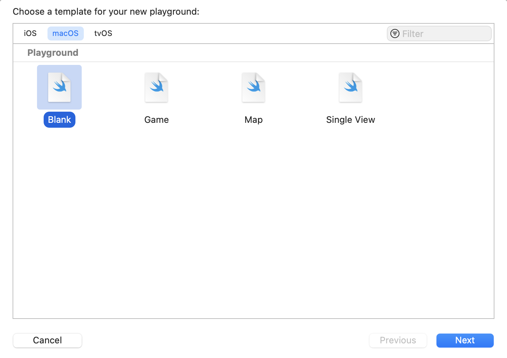
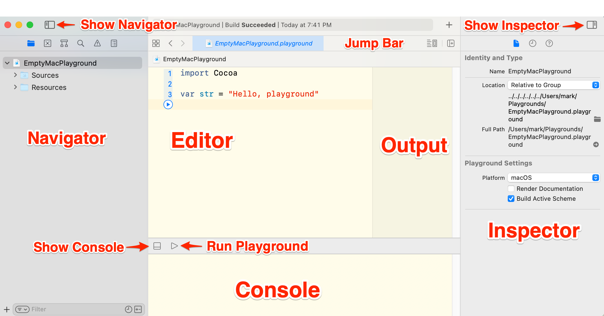

# Xcode Playgrounds

Xcode playgrounds let you experiment with Swift code. They're great for learning the Swift language.

## Creating a Playground

Launch Xcode and choose File> New > Playground to create a playground. The New Playground Assistant opens.

At the top are the three platforms Xcode playgrounds support: iOS, macOS, and tvOS. Click a platform. Each platform has the following playground templates:

* Blank
* Game
* Map
* Single View

In this book you will be creating blank templates. Select Blank and click the Next button.

A Save panel opens. Name the playground in the Save As text field. Choose a location to save the playground. Click the Create button to finish creating the playground.

## The Playground Window

The following screenshot shows the playground with various buttons and sections labeled:

The three main sections running left to right are the following:

* Navigator
* Editor
* Inspector

Above the editor is the jump bar. Below the editor is the console.

### Navigator

Xcode playgrounds have six navigators. There is a small button for each navigator at the top of the navigator. You can also press Cmd-1-6 to access the navigators.

* Project navigator
* Source control navigator
* Symbol navigator
* Find navigator
* Issue navigator
* Report navigator

Above the navigator is a button to toggle showing and hiding the navigator.

### Editor

The editor is where you type your Swift code. Next to the editor is a view where the output goes when you run the playground.

### Inspector

The inspector is used more in Xcode projects than playgrounds.

Above the inspector is a button to toggle showing and hiding the inspector.

### Jump Bar

Use the jump bar to quickly navigate to files.

On the right side of the jump bar. Use the left button to show or hide the live view. Click the right button to add another editor to the playground. Xcode initially adds the new editor to the right. Choose View > Change Editor Orientation to stack the editors vertically instead of horizontally.

### Console

The console displays the output from the `print` statements in the playground. Any errors that occur when running the playground will also appear in the console.

## Running a Playground

If you move the arrow over a line of code on the left edge of the editor, a Run button will appear. You can see the Run button under Line 3 in the playground window screenshot from The Playground Window section. Clicking the button will run all the code through the line of code where you clicked the Run button.

There is also a Run button at the bottom of the window. Click that button to run the whole playground and to stop running the playground.
